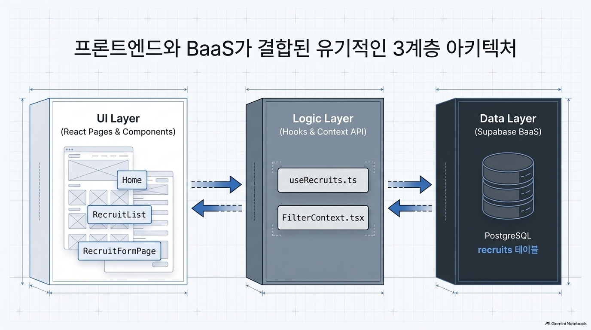
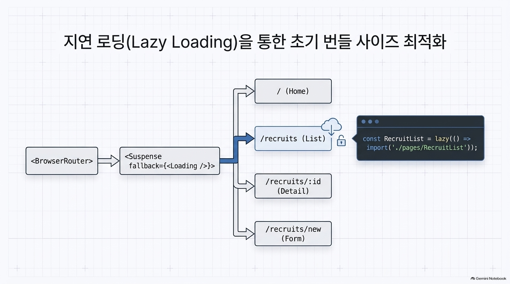
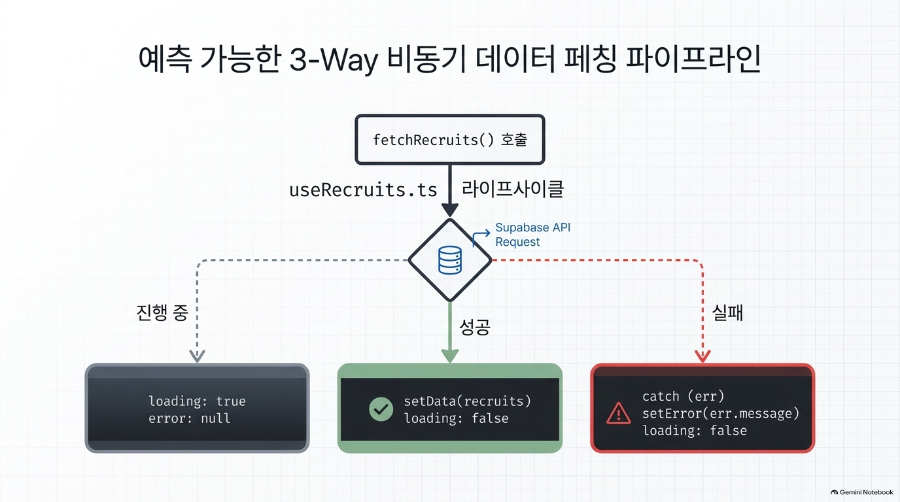
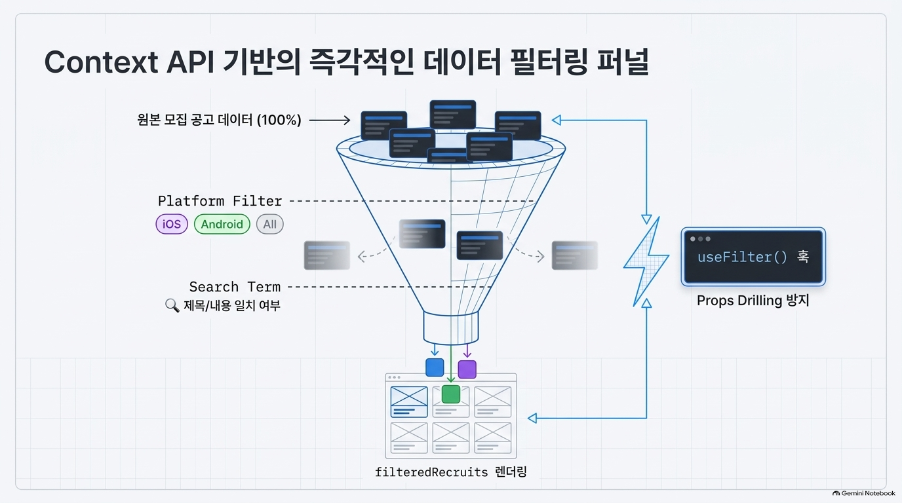
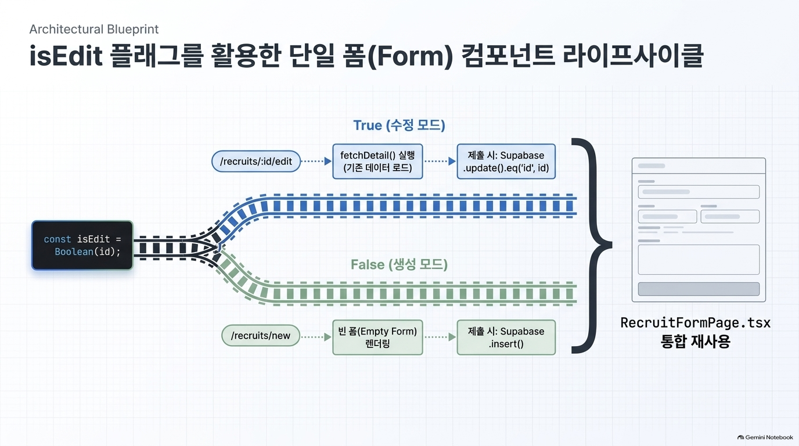
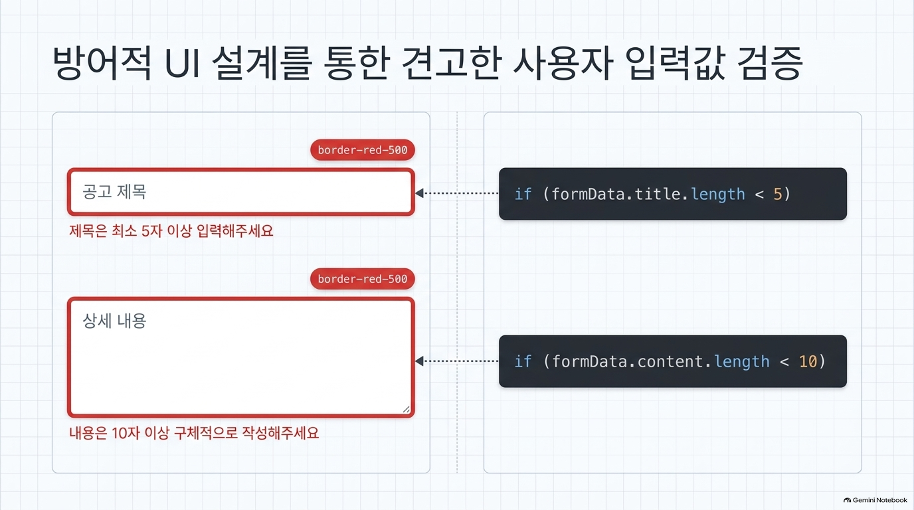
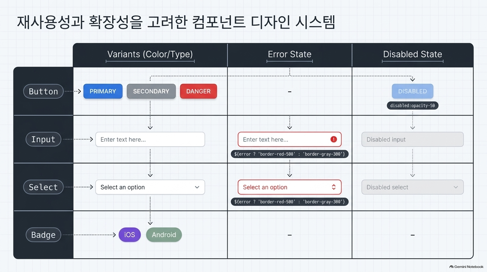

### 1. 프로젝트 한 줄 소개
- 앱 개발자와 베타 테스터를 매칭하는 모집 플랫폼"


### 2. 배포 링크 및 데모
- 사용자가 즉시 접속해 볼 수 있는 실제 배포 URL(`[https://jha21vvv.github.io/codyssey-b1-02_1]`)


### 3. 핵심 기능 목록 (Features)**
- 공고 등록, 상세 조회, 수정, 삭제(CRUD)
- 플랫폼별(Android/iOS/전체) 필터링 및 실시간 검색
- React.lazy 기반 코드 스플리팅 적용


### 4. 사용한 코드 관련
- Frontend: React, TypeScript, Vite, Tailwind CSS
- Backend/DB: Supabase (PostgreSQL)
- Deployment: GitHub Actions, GitHub Pages


### 5. 환경 변수 설정 (Environment Variables)**
- 로컬 실행 시 필요한 `.env` 파일의 변수 목록을 명시합니다.
```text
VITE_SUPABASE_URL=your_supabase_url
VITE_SUPABASE_ANON_KEY=your_supabase_anon_key

```


### 6.로컬 실행 방법 (Getting Started)**
- 저장소를 클론받은 뒤 실행하는 단계별 명령어를 표기합니다.
```bash
git clone https://github.com/jha21vvv/codyssey-b1-02_1.git
npm install
npm run dev

```

## 7. 파일구조
```
codyssey-b1-02_1/
├── .github/
│   └── workflows/
│       └── deploy.yml            # GitHub Pages 자동 빌드 및 배포 파이프라인
├── src/
│   ├── components/               # 재사용 공통 UI 컴포넌트
│   │   ├── Badge.tsx             # 플랫폼(Android/iOS) 라벨 배지
│   │   ├── Button.tsx            # 공통 버튼 컴포넌트 (primary, secondary 등)
│   │   ├── EmptyState.tsx        # 데이터가 없을 때 표시할 빈 상태 UI
│   │   ├── ErrorState.tsx        # 통신 실패 등 오류 발생 시 안내 및 재시도 UI
│   │   ├── Input.tsx             # 폼 및 검색에 쓰이는 공통 인풋 컴포넌트
│   │   ├── Layout.tsx            # 헤더/푸터 및 전역 내비게이션 레이아웃
│   │   ├── Loading.tsx           # 데이터 로딩 스피너 UI
│   │   ├── Modal.tsx             # 공고 삭제 확인용 모달 팝업
│   │   └── Select.tsx            # 플랫폼 선택 드롭다운 UI
│   ├── context/
│   │   └── FilterContext.tsx     # 플랫폼 탭 및 검색어 전역 상태 관리
│   ├── hooks/
│   │   └── useRecruits.ts        # Supabase 공고 목록 조회 및 재요청 커스텀 훅
│   ├── lib/
│   │   └── supabase.ts           # Supabase 클라이언트 초기화 인스턴스
│   ├── pages/                    # 라우팅 페이지 컴포넌트
│   │   ├── Home.tsx              # 메인 랜딩 페이지
│   │   ├── NotFound.tsx          # 404 예외 처리 페이지
│   │   ├── RecruitDetail.tsx     # 공고 상세 조회, 수정 링크 및 삭제 페이지
│   │   ├── RecruitFormPage.tsx   # 공고 신규 등록 및 기존 공고 수정 폼 페이지
│   │   └── RecruitList.tsx       # 공고 목록 카드 뷰 및 실시간 검색/필터링 페이지
│   ├── App.tsx                   # 라우팅 경로 정의 및 코드 스플리팅(lazy, Suspense)
│   ├── index.css                 # Tailwind CSS 전역 스타일
│   ├── main.tsx                  # React 루트 렌더링 진입점
│   └── vite-env.d.ts             # Vite 환경 변수 및 클라이언트 타입 선언
├── .env                          # 로컬 Supabase 환경 변수 (URL, ANON_KEY)
├── tsconfig.app.json             # TypeScript 앱 컴파일 옵션 설정
├── vercel.json                   # SPA 클라이언트 라우팅 리다이렉트 설정
└── vite.config.ts                # Vite 번들러 설정 및 GitHub Pages 베이스 경로 지정

## 기타 파일
public/favicon.svg & public/icons.svg #역할: 브라우저 탭 상단에 표시되는 아이콘(파비콘)과 사이트 기본 SVG 아이콘 이미지입니다.필요 여부: 필수입니다. 웹사이트가 열렸을 때 브라우저 탭 아이콘 표시와 UI 아이콘 랜더링에 사용됩니다.
src/assets/hero.png & src/assets/vite.svg: 역할: 화면 메인 배너 영역에 쓰이는 일러스트 이미지(hero.png)와 Vite 기본 로고(vite.svg)입니다.
index.html: 역할: 웹 브라우저가 사이트에 접속할 때 가장 먼저 읽는 HTML 루트 뼈대 문서입니다. <div id="root"></div> 공간을 제공하고 main.tsx 스크립트를 호출합니다.
package.json: 역할: 프로젝트에 설치된 외부 라이브러리 목록(react, supabase, tailwindcss 등)과 실행 스크립트(dev, build 등)를 정의하는 명세서입니다
package-lock.json: 역할: 모든 패키지와 하위 의존성들의 정확한 버전 트리를 고정(Lock)하여, 다른 컴퓨터나 GitHub Actions 서버에서 빌드할 때 동일한 환경을 보장합니다.
postcss.config.js: 역할: Tailwind CSS 문법을 일반 브라우저가 이해할 수 있는 순수 CSS 코드로 변환(트랜스파일)해 주는 빌드 도구 설정 파일입니다.
tsconfig.json: 역할: 전체 TypeScript 프로젝트의 진입점 설정으로, 실제 세부 규칙이 분리된 tsconfig.app.json과 tsconfig.node.json을 참조(Reference)하도록 연결해 줍니다.
tsconfig.node.json: 역할: 브라우저 화면 코드가 아니라, 프로젝트 빌드 도구(Vite 설정 파일 vite.config.ts 등 Node.js 환경에서 돌아가는 파일)에 적용되는 TypeScript 컴파일 규칙입니다.
```

See the [Oxlint rules documentation](https://oxc.rs/docs/guide/usage/linter/rules) for the full list of rules and categories.
### 개인 공부용

## 1. TS와 TSX 파일 형식의 차이 및 역할

TypeScript를 사용할 때 코드를 작성하는 두 가지 주요 확장자입니다.

## `.ts` (TypeScript)**
- 용도: 순수 로직, 유틸리티 함수, API 통신, 커스텀 훅, 타입 정의 등을 작성할 때 사용합니다.
- 특징: 화면을 그리는 HTML 태그 문법(JSX)이 포함되지 않은 순수 자바스크립트/타입스크립트 연산 코드입니다.
* **프로젝트 내 예시**: Supabase 클라이언트 연동 파일(`src/lib/supabase.ts`), 데이터 조회 커스텀 훅(`src/hooks/useRecruits.ts`).


## `.tsx` (TypeScript + JSX)**
- 용도: 화면 UI 컴포넌트를 정의할 때 사용합니다.
- 특징: `<div>`, `<button>` 같은 JSX 문법과 TypeScript 문법을 동시에 파싱할 수 있도록 지원하는 확장자입니다.
- 프로젝트 내 예시: 버튼 컴포넌트(`Button.tsx`), 공고 등록 폼 페이지(`RecruitFormPage.tsx`), 최상위 라우터(`App.tsx`).

## JSX 문법= JavaScript + HTML 형태의 마크업
- 자바스크립트(또는 타입스크립트) 코드 안에서 HTML 태그를 작성하듯 직관적으로 화면 UI를 만들 수 있게 해주는 문법 확장
- 일반 HTML과 90% 이상 비슷하지만, 자바스크립트 엔진이 읽어야 하므로 지켜야 하는 규칙이 몇 가지 있
- ① 자바스크립트 변수나 표현식은 중괄호 { } 안에 넣는다. HTML 태그 안에서 파이썬의 f-string(f"안녕하세요 {name}")처럼 변수나 계산 결과를 넣고 싶을 때 중괄호를 씁니다.
- ② 반드시 하나의 부모 태그로 감싸야 한다. 컴포넌트는 return할 때 두 개 이상의 독립된 태그를 나란히 둘 수 없습니다. 반드시 감싸는 부모 태그가 있어야 합니다.
- ③ HTML 속성 이름의 미세한 차이 (카멜 케이스) 자바스크립트의 예약어와 겹치지 않도록 일부 속성 이름이 바뀝니다.
- ④ 모든 태그는 반드시 닫아야 한다. 일반 HTML에서는 <input>, <br>,  등을 안 닫아도 브라우저가 대충 넘어가 주지만, JSX는 엄격한 XML 기반이므로 반드시 닫는 태그를 써야 합니다.
- ⑤ 스타일(style)은 객체(Object) 형태로 전달한다. CSS 스타일을 인라인으로 넣을 때는 문자열이 아니라 자바스크립트 객체({ key: value }) 형태로 넣어야 하므로 중괄호가 2겹({{ }})이 됩니다.
```
// 바깥 중괄호: "자바스크립트 쓸게요"
// 안쪽 중괄호: "스타일 속성을 담은 객체(Dictionary)예요"
<div style={{ color: "blue", fontSize: "16px" }}>파란 글씨</div>
```


## TypeScript기초 문법
- 파이썬의 변수: int = 10 같은 타입 힌트(Type Hint) 방식과 거의 같으며, 자바스크립트 기본 문법 위에 타입을 명시하는 규칙만 더해진 형태
- 변수 정의 예시: 
```
// 기본 원시 타입
const title: string = "테스터 모집";
let count: number = 10;
const isOpen: boolean = true;

// 배열 (파이썬의 List)
const platforms: string[] = ["Android", "iOS", "Web"];
// 또는 Array<string>

// 객체 (파이썬의 Dict)
interface Recruit {
  id: number;
  title: string;
  reward?: string; // 물음표(?)는 있어도 되고 없어도 되는 선택적 속성(Optional)
}

const item: Recruit = {
  id: 1,
  title: "금융 앱 테스터 모집",
  // reward는 선택이므로 생략 가능
};
```
- 조건문
```
// isEdit이 true면 "수정", false면 "등록"
const buttonText = isEdit ? "수정하기" : "등록하기";

// 1) 조건부 렌더링 (A가 참이면 B 실행)
{error && <span className="text-red-500">{error}</span>}

// 2) 기본값 지정 (A가 없으면 B 사용)
const rewardText = item.reward || "무료 참여";

// 3) 옵셔널 체이닝 (item이 null/undefined여도 에러 안 나고 통과)
const titleLength = item?.title?.length;
```
- 반복문
```
const platforms = ["Android", "iOS", "Web"];

// React 컴포넌트 내부에서 목록을 화면에 그릴 때
return (
  <ul>
    {platforms.map((p, index) => (
      <li key={index}>{p}</li>
    ))}
  </ul>
);

const numbers: number[] = [10, 20, 30];

// 1) forEach
numbers.forEach((num) => {
  console.log(num);
});

// 2) for...of (파이썬의 for num in numbers: 와 가장 유사)
for (const num of numbers) {
  console.log(num);
}
```
## 비동기 데이터 패칭 레이어: Custom Hooks 아키텍처
- 비동기 데이터 패칭 레이어 (장보기 전담 직원 두기)
요리사(화면 컴포넌트)가 직접 마트(데이터베이스)까지 뛰어가서 재료를 사 오면 요리에 집중할 수 없습니다.
그래서 재료 사 오는 일만 전담하는 심부름 직원(useRecruits.ts)을 따로 만들어 둔 것입니다.

- 선언적 데이터 요청 (원하는 재료 목록만 딱 적어주기)
"어느 통로로 가서 몇 번째 진열대 박스를 열고..."처럼 구체적인 과정을 일일이 지시하는 대신, "공고 테이블(recruits)에서 전체 목록(*)을 날짜 순(order)으로 가져와"라고 원하는 최종 결과만 명확하게 주문서 한 줄로 적는 방식입니다.
- 상태 캡슐화 (상황판 3종 세트 정리)
심부름 직원은 주방에 딱 3가지 정보만 보고합니다:
loading: "지금 장보러 가는 중인가요? (로딩 중)"
data: "사 온 재료가 뭔가요? (데이터)"
error: "혹시 마트 문이 닫혔나요? (에러)"
컴포넌트는 복잡한 통신 과정을 몰라도, 직원이 넘겨준 이 3가지 상태만 보고 "로딩 중이면 로딩창, 에러면 에러창, 성공하면 공고 목록"만 화면에 그리면 됩
- 폐쇄형 에러 핸들링 (에러가 나도 화면이 깨지지 않고 안내판 띄우기)
인터넷이 끊기거나 DB가 터져서 장보기에 실패하면, 앱 전체가 하얗게 멈추지(crash) 않습니다.
훅 내부의 catch 문이 사고를 막아서 setError("데이터를 불러오지 못했습니다")에 에러를 담아줍니다.
그러면 화면(RecruitList.tsx)은 즉시 준비해 둔 빨간색 에러 안내 상자(ErrorState UI)를 띄워 사용자에게 차분하게 상황을 알려줍니다.

## 노트 LM 이해를 이핸 자료



- 로딩창을 띄우기/ 준비된 데이터 띄우기/에러창 띄우기 /Users/jha21vvv5332/codyssey-b1-02_1/src/pages/RecruitList.tsx


- 수정이면 기존 폼 불러오고, 그걸 수정후 데이터 베이스에 넘김.
- 생성모드면 빈폼으로 생성 후 내용 넣으면 제출하는 형식.
- /Users/jha21vvv5332/codyssey-b1-02_1/src/pages/RecruitFormPage.tsx



## 학습 목표 기반 대답
- React에서 컴포넌트가 왜 필요한지, 그리고 본인이 어떤 기준으로 컴포넌트를 쪼갰는지 설명할 수 있다.
> 화면의 UI와 로직을 레고 블록처럼 독립된 단위로 묶어 코드 재사용성을 높이고 유지보수를 쉽게 만들기 위해 필요
> 재사용 가능한 공통 UI 단위: Button, Input, Select, Loading처럼 여러 화면에서 반복해서 쓰이는 기본 요소들을 공통 컴포넌트로 분리
> 페이지 단위(라우트 단위): 브라우저 주소(URL)에 따라 교체되는 큰 화면 단위(RecruitList, RecruitDetail, RecruitFormPage)로 분리
> 역할과 책임의 분리 (비즈니스 로직 분리): Supabase와 통신하여 데이터를 가져오고 에러를 처리하는 작업은 UI 컴포넌트 안에 두지 않고 useRecruits 같은 커스텀 훅으로 분리해 "화면을 그리는 역할"과 "데이터를 조달하는 역할"을 명확히 나눠
- props와 state의 차이, 그리고 상태를 어디에 두었는지(상향/하향 흐름) 설명할 수 있다.
> state: 컴포넌트 내부에서 생성하고 관리하며, 사용자의 입력이나 통신 결과에 따라 스스로 변경할 수 있는 데이터
> props: 부모 컴포넌트가 자식 컴포넌트에게 전달해 주는 읽기 전용(Read-only) 데이터입니다. 자식은 넘겨받은 props를 직접 수정할 수 없음
>하향 흐름 (Props Drilling & State): 폼 입력 상태(formData)는 여러 자식 입력창들을 취합해 DB로 전송해야 하므로, 부모인 RecruitFormPage에 두고 자식인 Input 태그로 내려주는 방식
> 상향 흐름 (이벤트 전달): 자식이 부모의 상태를 바꾸기 위해 직접 값을 조작하지 않고, 부모가 내려준 onChange={handleChange} 같은 이벤트 핸들러 함수를 실행해 부모에게 "입력값이 바뀌었다"고 신호만 올려보냄
> 전역 상태 (Context API): 상세 페이지로 이동했다가 목록으로 뒤로 가기를 눌러도 검색어와 플랫폼 필터가 초기화되지 않도록, 페이지 컴포넌트의 수명보다 상위인 FilterProvider에 전역 상태로 끌어올려 배치
- useEffect가 언제 실행되고, 어떤 의존성으로 동작하며, 데이터 요청과 어떤 관계가 있는지 설명할 수 있다.
> 실행 타이밍: 컴포넌트가 브라우저 화면에 렌더링을 마친 직후(DOM 반영 완료 후) 백그라운드에서 실행
> 의존성 배열(Dependency Array):대괄호 [] 안에 감시할 변수를 지정. 배열 안의 값이 이전 렌더링 시점과 비교해 달라졌을 때만 내부 코드를 다시 실행
> 네트워크를 통해 서버/DB에서 데이터를 가져오는 작업은 브라우저 렌더링을 멈추게 하면 안 되는 부수 효과. 컴포넌트가 화면을 먼저 띄운 뒤 useEffect를 통해 비동기(async/await)로 Supabase 데이터를 요청
- 비동기 흐름에서 로딩/성공/실패/빈 상태를 React UI로 어떻게 표현했는지 설명할 수 있다.
> 로딩 (Loading): 데이터를 가져오는 동안 loading: true 또는 loadingDetail: true 상태를 감지하여 스피너나 <Loading message="..."/> 안내 화면을 띄워 사용자에게 통신 중임
> 성공 (Success): DB 조회가 성공하면 loading: false로 전환하고, setData(recruits) 또는 setFormData(...)를 실행하여 받아온 실제 공고 카드와 입력창 화면을 정상 출력
>실패 (Error): 네트워크 끊김이나 DB 에러가 발생하면 try-catch 문의 catch 블록에서 에러를 잡아 setError(err.message) 또는 알림창을 띄우고, 준비해 둔 ErrorState UI나 목록 페이지 강제 이동(navigate)으로 복구 경로를 제공
> 빈 상태 (Empty): 에러는 없지만 검색 결과나 등록된 공고가 0개일 때(recruits.length === 0), 텅 빈 흰 화면 대신 "등록된 공고가 없습니다"라는 전용 Empty State 안내 문구를 표시
- “하나의 기능”을 만들기 위해 라우팅 → 컴포넌트 → 상태 → 이벤트 → 렌더링이 어떻게 연결되는지 설명할 수 있다.
> <<<<공고 등록/수정 기능 기준>>>>
> 라우팅: 사용자가 신규 등록 링크(/recruits/new)나 수정 링크(/recruits/1/edit)를 클릭하면 BrowserRouter가 URL을 감지해 RecruitFormPage 컴포넌트를 마운트
> 컴포넌트: RecruitFormPage가 호출되며 URL의 파라미터(useParams)를 통해 신규(isEdit = false)인지 수정(isEdit = true)인지 모드를 판별합니다.
> 상태: 수정 모드인 경우 useEffect가 실행되어 Supabase에서 기존 글을 조회해 formData 상태에 채우고, 신규인 경우 빈 상태로 시작합니다.
> 이벤트 (Event):사용자가 입력창에 글자를 칠 때마다 onChange 이벤트가 발생하고 handleChange 함수가 실행되어 setFormData를 통해 입력값을 실시간 동기화하며 에러 표시를 지웁니다.
> 렌더링 & 제출 (Rendering & Submit):입력된 값이 인풋의 value에 실시간으로 반영되어 화면에 그려집니다.[저장] 버튼을 누르면 onSubmit 이벤트가 handleSubmit을 호출해 클라이언트 유효성 검사(validate)를 거친 뒤, Supabase에 insert 또는 update를 비동기 전송하고 성공 시 상세 페이지로 라우팅을 이동시키며 기능의 라이프사이클을 완성합니다.
```
```

```
```

```
```

```
```
